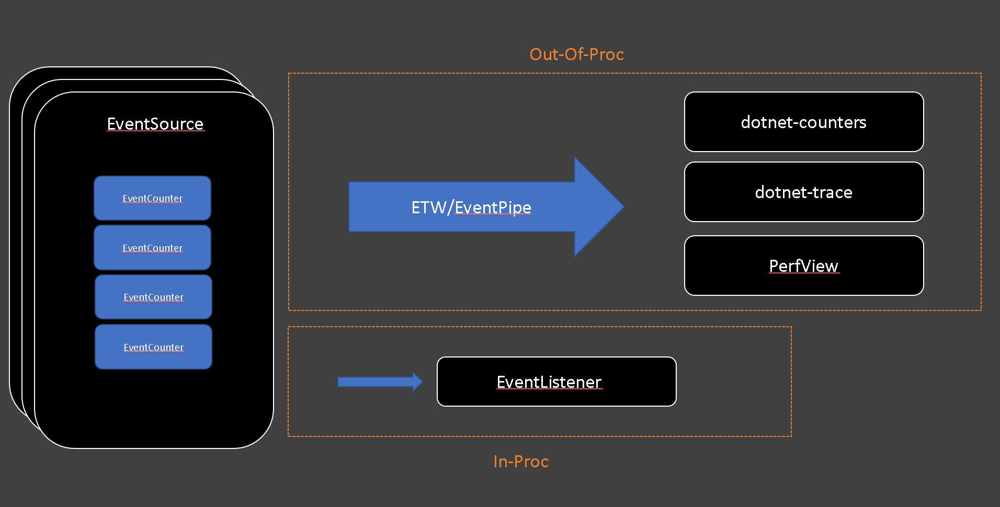

The newest documentation is now maintained at [eventcounters](https://learn.microsoft.com/dotnet/core/diagnostics/event-counters). This doc is no longer being updated.

# EventCounters in .NET Core 3.0

## Introduction
EventCounters are .NET Core APIs used for lightweight, cross-platform, and near real-time performance metric collection. EventCounters that were added as a cross-platform alternative to the "performance counters" on the .NET Framework on Windows. This documentation serves as a guide on what they are, how to implement them, and how to consume them.

The .NET Core runtime (CoreCLR) and few .NET libraries publish basic diagnostics information using EventCounters starting in .NET Core 3.0.

Apart from the EventCounters that are already provided by the .NET runtime or the rest of the framework (i.e. ASP.NET, gRPC, etc.), you may choose to implement your own EventCounters to keep track of various metrics for your service. 

EventCounters live as a part of an [EventSource](https://docs.microsoft.com/en-us/dotnet/api/system.diagnostics.tracing.eventsource?view=netcore-3.0) and are automatically pushed to listener tools on a regular basis. Like any other events on an `EventSource`, they can be consumed both in-proc and out-of-proc via [EventListener](https://docs.microsoft.com/en-us/dotnet/api/system.diagnostics.tracing.eventlistener?view=netcore-3.0) and EventPipe/ETW.



## Runtime Counters
The .NET runtime (CoreCLR) publishes the following list of counters:
`System.Runtime` provider
* CPU usage
* Working Set Size
* GC Heap Size
* Gen 0 GC Rate
* Gen 1 GC Rate
* Gen 2 GC Rate
* % Time in GC
* Gen 0 Heap Size
* Gen 1 Heap Size
* Gen 2 Heap Size
* LOH Heap Size
* Allocation Rate
* Assembly Count
* Exception Rate
* ThreadPool Thread Count
* Monitor Lock Contention Rate
* ThreadPool Queue Length
* ThreadPool Completed Items Rate
* Active Timer Count

Other components of .NET Core also publishes counters:
ASP.NET Core `Microsoft.AspNetCore.Hosting` provider
* Requests per second
* Total Requests Count
* Current Requests Count
* Failed Requests Count

SignalR `Microsoft.AspNetCore.Http.Connections` provider
* Total Connections Started
* Total Connections Stopped
* Total Connections Timed Out
* Average Connection Duration

## EventCounters API Overview
At a high level, there are two types of counters in terms of their *purpose* - counters for ever-increasing values (i.e. Total # of exceptions, Total # of GCs, Total # of requests, etc.) and "snapshot" values (heap usage, CPU usage, working set size, etc.). Within each of these categories of counters, there are also two types of counters depending on how they get their value - polling counters (value retrieved via a callback) and non-polling counters (value directly set on the counter). That gives us a total of 4 different counters, and each of these are implemented by `EventCounter`,  `PollingCounter`, `IncrementingEventCounter`, and `IncrementingPollingCounter`.

The runtime supports four different types of counters for different situations:

1. `EventCounter` records a set of values. The `WriteMetric()` method adds a new value to the set. At the end of each time interval, summary statistics for the set are computed such as the min, max, and mean. dotnet-counters will always display the mean value. EventCounter is useful to describe a discrete set of operations such as the average size in bytes of recent IO operations or the average monetary value of a set of financial transactions.

2. `IncrementingEventCounter` records a running total. The `Increment()` method increases this total. At the end of each time period the difference between the total value for that period and the total of the previous period is reported as an increment. dotnet-counters will display this as a rate, the recorded total / time. This counter is useful to measure how frequently an action is occurring such as the number of requests processed each second.

3. `PollingCounter` is a customizable counter that doesn't have any state and uses a callback to determine the value that is reported. At the end of each time interval the user provided callback function is invoked and whatever value it returns is reported as the current value of the counter. This counter can be used to query a metric from an external source, for example getting the current free bytes on a disk. It can also be used to report custom statistics that can be computed on demand by an application such as 95th percentile of recent request latencies or the current hit/miss ratio of a cache.

4. `IncrementingPollingCounter` is a customizable counter that has no state and uses a callback to determine the increment that is reported. At the end of each time interval the callback is invoked and then the difference between the current invocation and the last invocation is the reported value. `dotnet-counters` always displays this as a rate, the reported value / time. This is useful to measure the rate at which some action is occurring when it isn't feasible to call an API on each occurrence, but it is possible to query the total number of times it has occurred. For example you could report the number of bytes written to a file / sec even if there is no notification each time a byte is written.


## Writing EventCounters

The following code implements a sample `EventSource` exposed as `Samples-EventCounterDemos-Minimal` provider. This source contains an `EventCounter` representing request processing time. Such a counter has a name (i.e. its unique ID in the source) and a display name both used by listener tools such as dotnet-counter.

```cs

using System;
using System.Diagnostics.Tracing;

[EventSource(Name = "Samples-EventCounterDemos-Minimal")]
public sealed class MinimalEventCounterSource : EventSource
{
    // define the singleton instance of the event source
    public static MinimalEventCounterSource Log = new MinimalEventCounterSource();
    public EventCounter RequestTimeCounter;

    private MinimalEventCounterSource() : base(EventSourceSettings.EtwSelfDescribingEventFormat) 
    {
        this.RequestTimeCounter = new EventCounter("request-time", this)
        {
            DisplayName = "Request Processing Time",
            DisplayUnits = "MSec"
        };
    }

    public static void Main()
    {
        var rand = new Random();
        while(true)
        {
            MinimalEventCounterSource.Log.RequestTimeCounter.WriteMetric(rand.NextDouble());
        }
    }
}
```

Create a new dotnet console app using the code above and run it. Then use `dotnet-counters ps` to see what its process ID is:

```cmd
C:\>dotnet-counters ps
   1398652 dotnet     C:\Program Files\dotnet\dotnet.exe
   1399072 dotnet     C:\Program Files\dotnet\dotnet.exe
   1399112 dotnet     C:\Program Files\dotnet\dotnet.exe
   1401880 dotnet     C:\Program Files\dotnet\dotnet.exe
   1400180 sample-counters C:\sample-counters\bin\Debug\netcoreapp3.1\sample-counters.exe
```

You need to pass the `EventSource` name as an argument to `--providers` to start monitoring your counter with the following command:
```cmd
C:\>dotnet-counters monitor --process-id 1400180 --providers Samples-EventCounterDemos-Minimal
```

Then you will see the following screen in your console:
```
Press p to pause, r to resume, q to quit.
    Status: Running

[Samples-EventCounterDemos-Minimal]
    Request Processing Time (MSec)                            0.445
```

Let's take a look at a couple of sample EventCounter implementation in the .NET Core runtime (CoreCLR). Here is the runtime implementation for the counter that tracks the working set size of the application.

```cs
PollingCounter workingSetCounter = new PollingCounter(
    "working-set",
    this,
    () => (double)(Environment.WorkingSet / 1_000_000)
) 
{
    DisplayName = "Working Set",
    DisplayUnits = "MB"
};
```

This counter reports the current working set of the app. It is a `PollingCounter`, since it captures a metric at a moment in time. The callback for polling the values is `() => (double)(Environment.WorkingSet / 1_000_000)` which is simply just a call to `Environment.WorkingSet` API. The `DisplayName` and `DisplayUnits` is an optional property that can be set to help the consumer side of the counter to display the value more easily/accurately. For example `dotnet-counters` uses these properties to display the more "pretty" version of the counter names. 

And that's it! For `PollingCounter` (or `IncrementingPollingCounter`), there is nothing else that needs to be done since they poll the values themselves at the interval requested by the consumer.

Here is another example of runtime counter implemented using `IncrementingPollingCounter`.

```cs
IncrementingPollingCounter monitorContentionCounter = new IncrementingPollingCounter(
    "monitor-lock-contention-count",
    this,
    () => Monitor.LockContentionCount
)
{
    DisplayName = "Monitor Lock Contention Count",
    DisplayRateTimeScale = new TimeSpan(0, 0, 1)
};
```

This counter uses the [Monitor.LockContentionCount](https://docs.microsoft.com/en-us/dotnet/api/system.threading.monitor.lockcontentioncount?view=netcore-3.0) API to report the increment of the total lock contention count. The `DisplayRateTimeScale` property is an optional `TimeSpan` which can be set to provide a hint of what time interval this counter is best displayed at. For example, the lock contention count is best displayed as *count per second*, so its `DisplayRateTimeScale` is set to 1 second. This can be adjusted for different types of rate counters.

There are more runtime counter implementation to use as a reference in the [CoreCLR](https://github.com/dotnet/runtime/blob/main/src/coreclr/System.Private.CoreLib/src/System/Diagnostics/Eventing/RuntimeEventSource.cs) repo.

## Concurrency 
It is important to note that if the delegates passed to the `PollingCounter`/`IncrementingPollingCounter` instances are called by multiple threads at once, the EventCounters API does not guarantee thread safety. It is the author's responsibility to guarantee the thread-safety of the delegates being passed to the counter APIs.

For example, let's suppose we have the following `EventSource` to keep track of requests.

```cs
public class RequestEventSource : EventSource
{
    // singleton instance of the eventsource.
    public static RequestEventSource Log = new RequestEventSource();

    public IncrementingPollingCounter requestRateCounter;
    private int _requestCnt;

    private RequestEventSource() : base(EventSourceSettings.EtwSelfDescribingEventFormat)
    {
        _requestCnt = 0;
        this.requestRateCounter = new IncrementingPollingCounter("request-rate", this, () => _requestCnt)
        {
            DisplayName = "Request Rate",
            DisplayRateTimeScale = TimeSpan.FromSeconds(1)
        };
    }

    // Method being called from request handlers to log that a request happened
    public void AddRequest()
    {
        _requestCnt += 1;
    }
}
```

`RequestEventSource.AddRequest()` can be called from a request handler, and `requestRateCounter` simply polls this value at the interval specified by the consumer of this counter. However, this method can be called by multiple threads at once, putting a race condition on `_requestCnt`.

Therefore, this method should be modified to update the value in a thread-safe way.
```cs
public void AddRequest()
{
    Interlocked.Increment(ref _requestCnt);
}
```

## Consuming EventCounters

There are two main ways of consuming EventCounters: in-proc and out-of-proc. 

### Consuming in-proc

You can consume the counter values via the `EventListener` API. `EventListener` is an in-proc way of consuming any Events written by all instances of EventSources in your application. For more details on how to use the EventListener API, refer to the [EventListener documentation](https://docs.microsoft.com/en-us/dotnet/api/system.diagnostics.tracing.eventlistener).

First, the EventSource that produces the counter value needs to be enabled. To do this, you can override the `OnEventSourceCreated` method to get a notification when an EventSource is created, and if this is the correct EventSource with your EventCounters, then you can call Enable on it. Here is an example of such override:

```cs
protected override void OnEventSourceCreated(EventSource source)
{
    if (source.Name.Equals("System.Runtime"))
    {
        Dictionary<string, string> refreshInterval = new Dictionary<string, string>()
        {
            { "EventCounterIntervalSec", "1" }
        };
        EnableEvents(source, 1, 1, refreshInterval);
    }
}
```

#### Sample Code

This is a sample `EventListener` class that simply prints out all the counter names and values from a the .NET runtime's EventSource for publishing its internal counters (`System.Runtime`) at some interval.

```cs
public class SimpleEventListener : EventListener
{        
    private readonly EventLevel _level = EventLevel.Verbose;

    public int EventCount { get; private set; } = 0;

    private int _intervalSec;

    public SimpleEventListener(int intervalSec)
    {
        _intervalSec = intervalSec;
    }


    protected override void OnEventSourceCreated(EventSource source)
    {
        if (source.Name.Equals("System.Runtime"))
        {
            var refreshInterval = new Dictionary<string, string>();
            refreshInterval.Add("EventCounterIntervalSec", "1");
            EnableEvents(source, _level, (EventKeywords)(-1), refreshInterval);
        }
    }

    private (string Name, string Value) GetRelevantMetric(IDictionary<string, object> eventPayload)
    {
        string counterName = "";
        string counterValue = "";

        foreach ( KeyValuePair<string, object> payload in eventPayload )
        {
            string key = payload.Key;
            string val = payload.Value.ToString();

            if (key.Equals("DisplayName"))
            {
                counterName = val;
            }
            else if (key.Equals("Mean") || key.Equals("Increment"))
            {
                counterValue = val;
            }
        }
        return (counterName, counterValue);
    }

    protected override void OnEventWritten(EventWrittenEventArgs eventData)
    {
        if (eventData.EventName.Equals("EventCounters"))
        {
            for (int i = 0; i < eventData.Payload.Count; i++)
            {
                IDictionary<string, object> eventPayload = eventData.Payload[i] as IDictionary<string, object>;

                if (eventPayload != null)
                {
                    var counterKV = GetRelevantMetric(eventPayload);
                    Console.WriteLine($"{counterKV.Name} : {counterKV.Value}");
                }
            }
        }
    }
}
```

As shown above, you *must* make sure the `"EventCounterIntervalSec"` argument is set in the filterPayload argument when calling `EnableEvents`. Otherwise the counters will not be able to flush out values since it doesn't know at which interval it should be getting flushed out.

### Consuming out-of-proc

Consuming EventCounters out-of-proc is also possible. For those that are familiar with ETW (Event Tracing for Windows), you can use ETW to capture counter data as events and view them on your ETW trace viewer (PerfView, WPA, etc.). You may also use `dotnet-counters` to consume it cross-platform via EventPipe. You can also use TraceEvent to consume these.

#### dotnet-counters

dotnet-counters is a cross-platform dotnet CLI tool that can be used to monitor the counter values. To find out how to use `dotnet-counters` to monitor your counters, refer to the [dotnet-counters documentation](https://github.com/dotnet/diagnostics/blob/main/documentation/dotnet-counters-instructions.md).


#### ETW/PerfView

Since EventCounter payloads are reported as `EventSource` events, you can use PerfView to collect/view these counter-data.

Here is a command that can be passed to PerfView to collect an ETW trace with the counters.
```
PerfView.exe /onlyProviders=*Samples-EventCounterDemos-Minimal:EventCounterIntervalSec=1 collect
```


#### dotnet-trace

Similar to how PerfView can be used to consume the counter data through ETW, dotnet-trace can be used to consume the counter data through EventPipe. 

Here is an example of using dotnet-trace to get the same counter data.
```
dotnet-trace collect --process-id <pid> --providers Samples-EventCounterDemos-Minimal:0:0:EventCounterIntervalSec=1
```

The official dotnet-trace documentation contains a [section](https://github.com/dotnet/diagnostics/blob/main/documentation/dotnet-trace-instructions.md#using-dotnet-trace-to-collect-counter-values-over-time) on how to do this in more detail.


#### TraceEvent

TraceEvent is a managed library that makes it easy to consume ETW and EventPipe events. For more information, refer to the [TraceEvent Library Programmers Guide](https://github.com/Microsoft/perfview/blob/main/documentation/TraceEvent/TraceEventProgrammersGuide.md).

For some more detailed code samples, you can also try reading [Criteo Labs blog](https://medium.com/criteo-labs/net-core-counters-internals-how-to-integrate-counters-in-your-monitoring-pipeline-5354cd61b42e) on how to do this.
