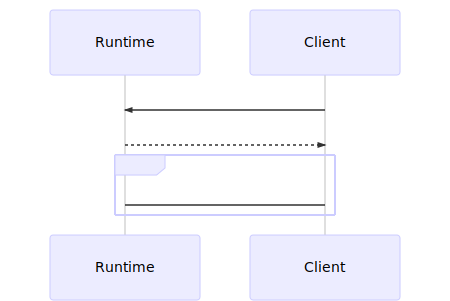

# Diagnostic IPC Protocol

## Overview

This spec describes the IPC Protocol to be used for communicating with the dotnet core runtime's Diagnostics Server from an external client over a platform-specific transport, e.g., Unix Domain Sockets.


### Terminology

The protocol will use the following names for various constructs and behaviors defined in this spec:
* *Diagnostic IPC Protocol*: The protocol defined in this spec
* *Diagnostic Server*: The server in the runtime that receives/sends Diagnostic IPC Procotol communication.
* *Commands*: The functionality being invoked in the runtime that communicates over the Diagnostic IPC Protocol, e.g., "Start an EventPipe stream".  These are encoded as a `command_set` and a `command_id`.
* *Flow*: A sequence of interactions making up communication with the Diagnostics Server
* *Pipe*: The duplex communication construct this protocol is communicated over.  This is a Unix Domain Socket on *nix systems and a Named Pipe on Windows.
* *IPC Message*: The base unit of communication over the Diagnostic IPC Protocol. Is made up of a Header and a Payload.
* *Header*: A struct containing a magic version, the size, a command, and metadata.
* *Payload*: An opaque chunk of data that is Command specific.
* *Optional Continuation*: The reuse of the pipe for application specific communication. This communication does not need to adhere to any requirements listed in this spec, e.g., this could be a stream of custom encoded data that is Command specific.

## General Flow

All communication with the Diagnostic Server will begin with a Diagnostic IPC Message sent from the client to the server.  The server will respond with a Diagnostic IPC Message.  After this, the client and runtime _may_ reuse the Pipe for any Command specific communication which is referred to as an Optional Continuation.



```
runtime <- client : [ Header ][ Payload ]
runtime -> client : [ Header ][ Payload ]
optional:
    runtime <-> client : [ Optional Continuation ]
connection closed
```

Example flow for EventPipe:
```
runtime <- client : [ magic; size; EventPipe CollectTracing ][ stream config struct  ] <- Diagnostic IPC Message
runtime -> client : [ magic; size; Server OK                ][ sessionId             ] <- Diagnostic IPC Message
runtime -> client : [ stream of nettrace data ]                                        <- Optional Continuation

// stop message is sent on another connection

connection closed
```

## Transport

The protocol will be communicated over a platform-specific transport.  On Unix/Linux based platforms, a Unix Domain Socket will be used, and on Windows, a Named Pipe will be used.

#### Naming and Location Conventions

Unix Domain Sockets (MacOS and *nix):

The socket is placed in one of two places:
1. The directory specified in `$TMPDIR`
2. `/tmp` if `$TMPDIR` is undefined/empty

In order to ensure filename uniqueness, a `disambiguation key` is generated.  On Mac and NetBSD, this is the process start time encoded as the number of seconds since UNIX epoch time.  If `/proc/$PID/stat` is available (all other *nix platforms), then the process start time encoded as jiffies since boot time is used.

> NOTE: If the target application is running inside an application sandbox on MacOS, the transport will be placed in the Application Group container directory.  This is a convention for all sandboxed applications on MacOS.

socket name:
```c
dotnet-diagnostic-{%d:PID}-{%llu:disambiguation key}-socket
```

Named Pipes (Windows):
```
\\.\pipe\dotnet-diagnostic-{%d:PID}
```

## Messages

Diagnostic IPC Messages are the base unit of communication with the Diagnostic Server.  A Diagnostic IPC Message contains a Header and Payload (described in following sections).

<table>
  <tr>
    <th>1</th>
    <th>2</th>
    <th>3</th>
    <th>4</th>
    <th>5</th>
    <th>6</th>
    <th>7</th>
    <th>8</th>
    <th>9</th>
    <th>10</th>
    <th>11</th>
    <th>12</th>
    <th>13</th>
    <th>14</th>
    <th>15</th>
    <th>16</th>
    <th>17</th>
    <th>18</th>
    <th>19</th>
    <th>20</th>
    <th>21</th>
    <th>22</th>
    <th>23</th>
    <th>24</th>
    <th>...</th>
    <th>size - 1 </th>
    <th>size</th>
  </tr>
  <tr>
    <td colspan="20">header</td>
    <td colspan="7">payload</td>
  </tr>
  <tr>
    <td colspan="14">magic</td>
    <td colspan="2">size</td>
    <td colspan="1">command_set</td>
    <td colspan="1">command_id</td>
    <td colspan="2">reserved</td>
    <td colspan="7">payload</td>
  </tr>
</table>

The simplest Diagnostic IPC Message will contain a Header and an empty Payload and therefore only be 20 bytes long.

For example, this IPC Message is the generic OK message which has an empty Payload:
<table>
  <tr>
    <th>1</th>
    <th>2</th>
    <th>3</th>
    <th>4</th>
    <th>5</th>
    <th>6</th>
    <th>7</th>
    <th>8</th>
    <th>9</th>
    <th>10</th>
    <th>11</th>
    <th>12</th>
    <th>13</th>
    <th>14</th>
    <th>15</th>
    <th>16</th>
    <th>17</th>
    <th>18</th>
    <th>19</th>
    <th>20</th>
  </tr>
  <tr>
    <tr>
    <td colspan="14">magic</td>
    <td colspan="2">size</td>
    <td colspan="2">command</td>
    <td colspan="2">reserved</td>
  </tr>
  <tr>
    <td colspan="14">"DOTNET_IPC_V1"</td>
    <td colspan="2">20</td>
    <td colspan="1">0xFF</td>
    <td colspan="1">0x00</td>
    <td colspan="2">0x0000</td>
  </tr>
</table>

### Headers

Every Diagnostic IPC Message will start with a header and every header will:
* start with a magic version number and a size
* `sizeof(IpcHeader) == 20`
* encode numbers little-endian
* account for the size of the payload in the `size` value, i.e., `IpcHeader.size == sizeof(IpcHeader) + PayloadStruct.GetSize()`

```c
// size = 14 + 2 + 1 + 1 + 2 = 20 bytes
struct IpcHeader
{
    uint8_t[14]  magic = "DOTNET_IPC_V1";
    uint16_t     size;        // size of packet = size of header + payload
    uint8_t      command_set; // combined with command_id is the Command to invoke
    uint8_t      command_id;  // combined with command_set is the Command to invoke
    uint16_t     reserved;    // for potential future use
};
```

The `reserved` field is reserved for future use.  It is unused in `DOTNET_IPC_V1` and must be 0x0000.


### Payloads

Payloads are Command specific data encoded into a Diagnostic IPC Message.  The size of the payload is implicitly encoded in the Header's `size` field as `PayloadSize = header.size - sizeof(struct IpcHeader)`.  A Payload _may_ be 0 bytes long if it empty.  The encoding of data in the Payload is Command specific.

Payloads are either encoded as fixed size structures that can be `memcpy`'ed , _or_:

* `X, Y, Z` means encode bytes for `X` followed by bytes for `Y` followed by bytes for `Z`
* `uint` = 4 little endian bytes
* `ulong` = 8 little endian bytes
* `wchar` = 2 little endian bytes, UTF16 encoding
* `array<T>` = uint length, length # of `T`s
* `string` = (`array<wchar>` where the last `wchar` must = `0`) or (length = `0`)

As an example, the CollectTracing command to EventPipe (explained below) encodes its Payload as:

<table>
  <tr>
    <th>1</th>
    <th>2</th>
    <th>3</th>
    <th>4</th>
    <th>5</th>
    <th>6</th>
    <th>7</th>
    <th>8</th>
    <th>9</th>
    <th>10</th>
    <th>11</th>
    <th>12</th>
    <th>13</th>
    <th>14</th>
    <th>15</th>
    <th>16</th>
    <th>17</th>
    <th>18</th>
    <th>19</th>
    <th>20</th>
    <th>21</th>
    <th>22</th>
    <th>23</th>
    <th>24</th>
    <th>25</th>
    <th>26</th>
    <th>27</th>
    <th>28</th>
    <th>29</th>
    <th>30</th>
    <th>31</th>
    <th>32</th>
    <th>33</th>
    <th>34</th>
    <th>35</th>
    <th>36</th>
    <th>37</th>
    <th>38</th>
    <th>39</th>
    <th>40</th>
    <th>41</th>
    <th>42</th>
    <th>43</th>
    <th>44</th>
    <th>45</th>
    <th>46</th>
    <th>47</th>
    <th>48</th>
    <th>49</th>
    <th>50</th>
    <th>51</th>
    <th>52</th>
    <th>53</th>
    <th>54</th>
    <th>55</th>
    <th>56</th>
    <th>57</th>
    <th>58</th>
    <th>59</th>
    <th>60</th>
    <th>61</th>
    <th>62</th>
    <th>63</th>
    <th>64</th>
    <th>65</th>
    <th>66</th>
    <th>67</th>
    <th>68</th>
    <th>69</th>
    <th>70</th>
    <th>71</th>
    <th>72</th>
    <th>73</th>
    <th>74</th>
    <th>75</th>
    <th>76</th>
    <th>77</th>
    <th>78</th>
  </tr>
  <tr>
    <td colspan="20">Header</td>
    <td colspan="58">Payload</td>
  </tr>
  <tr>
    <td colspan="14">magic</td>
    <td colspan="2">size</td>
    <td colspan="2">command</td>
    <td colspan="2">reserved</td>
    <td colspan="4">circularBufferMB</td>
    <td colspan="4">outputPath Length</td>
    <td colspan="16">outputPath String</td>
    <td colspan="4">n Providers</td>
    <td colspan="8">Keywords</td>
    <td colspan="4">logLevel</td>
    <td colspan="4">provider_name length</td>
    <td colspan="14">provider_name string</td>
  </tr>
  <tr>
    <td colspan="14">"DOTNET_IPC_V1"</td>
    <td colspan="2">78</td>
    <td colspan="2">0x0202</td>
    <td colspan="2">0x0000</td>
    <td colspan="4">250</td>
    <td colspan="4">16</td>
    <td colspan="16">"/tmp/foo.nettrace"</td>
    <td colspan="4">1</td>
    <td colspan="8">100</td>
    <td colspan="4">2</td>
    <td colspan="4">14</td>
    <td colspan="14">"MyEventSource"</td>
  </tr>
</table>

Where `0x0202` is the Command to start streaming with EventPipe.

### Commands

Commands are a `command_set` and a `command_id`.  A `command_set` is analogous to a namespace for `command_id`s.  The typical grouping is by service running on the Diagnostic Server, e.g., there is a `command_set` for EventPipe.  This allows multiple services to have the same `command_id`s without clashing.  The combination of a `command_set` and a `command_id` encodes the Command being invoked on the Diagnostic Server.

The current set of `command_set`s and `command_id`s are listed below:

```c++
enum class CommandSet : uint8_t
{
    // reserved = 0x00,
    Dump        = 0x01,
    EventPipe   = 0x02,
    Profiler    = 0x03,
    Process     = 0x04,
    // future

    Server = 0xFF,
};
```

```c++
enum class ServerCommandId : uint8_t
{
    OK    = 0x00,
    Error = 0xFF,
};
```

```c++
enum class EventPipeCommandId : uint8_t
{
    // reserved = 0x00,
    StopTracing     = 0x01, // stop a given session
    CollectTracing  = 0x02, // create/start a given session
    CollectTracing2 = 0x03, // create/start a given session with/without rundown
}
```
See: [EventPipe Commands](#EventPipe-Commands)

```c++
enum class DumpCommandId : uint8_t
{
    // reserved     = 0x00,
    CreateCoreDump  = 0x01,
    // future
}
```
See: [Dump Commands](#Dump-Commands)

```c++
enum class ProfilerCommandId : uint8_t
{
    // reserved     = 0x00,
    AttachProfiler  = 0x01,
    // future
}
``` 
See: [Profiler Commands](#Profiler-Commands)

```c++
enum class ProcessCommandId : uint8_t
{
    ProcessInfo        = 0x00,
    ResumeRuntime      = 0x01,
    ProcessEnvironment = 0x02,
    ProcessInfo2       = 0x04,
    ApplyStartupHook   = 0x07
    // future
}
```
See: [Process Commands](#Process-Commands)

Commands may use the generic `{ magic="DOTNET_IPC_V1"; size=20; command_set=0xFF (Server); command_id=0x00 (OK); reserved = 0x0000; }` to indicate success rather than having a command specific success `command_id`.

For example, the Command to start a stream session with EventPipe would be `0x0202` made up of `0x02` (the `command_set` for EventPipe) and `0x02` (the `command_id` for CollectTracing).

## EventPipe Commands

```c++
enum class EventPipeCommandId : uint8_t
{
    // reserved = 0x00,
    StopTracing     = 0x01, // stop a given session
    CollectTracing  = 0x02, // create/start a given session
    CollectTracing2 = 0x03, // create/start a given session with/without rundown
}
```
EventPipe Payloads are encoded with the following rules:

* `X, Y, Z` means encode bytes for `X` followed by bytes for `Y` followed by bytes for `Z`
* `uint` = 4 little endian bytes
* `ulong` = 8 little endian bytes
* `wchar` = 2 little endian bytes, UTF16 encoding
* `byte` = 1 unsigned little endian byte
* `array<T>` = uint length, length # of `T`s
* `string` = (`array<wchar>` where the last `wchar` must = `0`) or (length = `0`)

### `CollectTracing`

Command Code: `0x0202`

The `CollectTracing` Command is used to start a streaming session of event data.  The runtime will attempt to start a session and respond with a success message with a payload of the `sessionId`.  The event data is streamed in the `nettrace` format.  The stream begins after the response Message from the runtime to the client.  The client is expected to continue to listen on the transport until the connection is closed.

In the event there is an [error](#Errors), the runtime will attempt to send an error message and subsequently close the connection.

The client is expected to send a [`StopTracing`](#StopTracing) command to the runtime in order to stop the stream, as there is a "run down" at the end of a stream session that transmits additional metadata.

If the stream is stopped prematurely due to a client or server error, the `nettrace` file generated will be incomplete and should be considered corrupted.

#### Inputs:

Header: `{ Magic; Size; 0x0202; 0x0000 }`

* `uint circularBufferMB`: The size of the circular buffer used for buffering event data while streaming
* `uint format`: 0 for the legacy NetPerf format and 1 for the NetTrace format
* `array<provider_config> providers`: The providers to turn on for the streaming session

A `provider_config` is composed of the following data:
* `ulong keywords`: The keywords to turn on with this providers
* `uint logLevel`: The level of information to turn on
* `string provider_name`: The name of the provider
* `string filter_data` (optional): Filter information

> see ETW documentation for a more detailed explanation of Keywords, Filters, and Log Level.

#### Returns (as an IPC Message Payload):

Header: `{ Magic; 28; 0xFF00; 0x0000; }`

`CollectTracing` returns:
* `ulong sessionId`: the ID for the stream session starting on the current connection

##### Details:

Input:
```
Payload
{
    uint circularBufferMB,
    uint format,
    array<provider_config> providers
}

provider_config 
{
    ulong keywords,
    uint logLevel,
    string provider_name,
    string filter_data (optional)
}
```

Returns:
```c
Payload
{
    ulong sessionId
}
```
Followed by an Optional Continuation of a `nettrace` format stream of events.

### `CollectTracing2`

Command Code: `0x0203`

The `CollectTracing2` Command is an extension of the `CollectTracing` command - its behavior is the same as `CollectTracing` command, except that it has another field that lets you specify whether rundown events should be fired by the runtime.

#### Inputs:

Header: `{ Magic; Size; 0x0203; 0x0000 }`

* `uint circularBufferMB`: The size of the circular buffer used for buffering event data while streaming
* `uint format`: 0 for the legacy NetPerf format and 1 for the NetTrace format
* `bool requestRundown`: Indicates whether rundown should be fired by the runtime.
* `array<provider_config> providers`: The providers to turn on for the streaming session

A `provider_config` is composed of the following data:
* `ulong keywords`: The keywords to turn on with this providers
* `uint logLevel`: The level of information to turn on
* `string provider_name`: The name of the provider
* `string filter_data` (optional): Filter information

> see ETW documentation for a more detailed explanation of Keywords, Filters, and Log Level.
> 
#### Returns (as an IPC Message Payload):

Header: `{ Magic; 28; 0xFF00; 0x0000; }`

`CollectTracing2` returns:
* `ulong sessionId`: the ID for the stream session starting on the current connection

##### Details:

Input:
```
Payload
{
    uint circularBufferMB,
    uint format,
    bool requestRundown,
    array<provider_config> providers
}

provider_config 
{
    ulong keywords,
    uint logLevel,
    string provider_name,
    string filter_data (optional)
}
```

Returns:
```c
Payload
{
    ulong sessionId
}
```
Followed by an Optional Continuation of a `nettrace` format stream of events.

### `StopTracing` 

Command Code: `0x0201`

The `StopTracing` command is used to stop a specific streaming session.  Clients are expected to use this command to stop streaming sessions started with [`CollectStreaming`](#CollectStreaming).

#### Inputs:

Header: `{ Magic; 28; 0x0201; 0x0000 }`

* `ulong sessionId`: The ID for the streaming session to stop

#### Returns:

Header: `{ Magic; 28; 0xFF00; 0x0000 }`

* `ulong sessionId`: the ID for the streaming session that was stopped


##### Details:

Inputs:
```c
Payload
{
   ulong sessionId
}
```

Returns:
```c
Payload
{
   ulong sessionId
}
```

## Dump Commands

### `CreateCoreDump`

Command Code: `0x0101`

The `CreateCoreDump` command is used to instruct the runtime to generate a core dump of the process.  The command will keep the connection open while the dump is generated and then respond with a message containing an `HRESULT` indicating success or failure.

In the event of an [error](#Errors), the runtime will attempt to send an error message and subsequently close the connection.

#### Inputs:

Header: `{ Magic; Size; 0x0101; 0x0000 }`

* `string dumpName`: The name of the dump generated.
* `uint dumpType`: A value between 1 and 4 inclusive that indicates the type of dump to take
  * Normal = 1,
  * WithHeap = 2,
  * Triage = 3,
  * Full = 4
* `uint diagnostics`: If set to 1, log to console the dump generation diagnostics
  * `0` or `1` for on or off

#### Returns (as an IPC Message Payload):

Header: `{ Magic; 28; 0xFF00; 0x0000; }`

`CreateCoreDump` returns:
* `int32 hresult`: The result of creating the core dump (`0` indicates success)

##### Details:

Input:
```
Payload
{
    string dumpName,
    uint dumpType,
    uint diagnostics
}
```

Returns:
```c
Payload
{
    int32 hresult
}
```

## Profiler Commands

### `AttachProfiler`

Command Code: `0x0301`

The `AttachProfiler` command is used to attach a profiler to the runtime.  The command will keep the connection open while the profiler is being attached and then respond with a message containing an `HRESULT` indicating success or failure.

In the event of an [error](#Errors), the runtime will attempt to send an error message and subsequently close the connection.

#### Inputs:

Header: `{ Magic; Size; 0x0301; 0x0000 }`

* `uint32 attachTimeout`: The timeout for attaching to the profiler (in milliseconds)
* `CLSID profilerGuid`: The GUID associated with the profiler
* `string profilerPath`: Location of the profiler
* `array<byte> clientData`: The data being provided to the profiler

Where a `CLSID` is a fixed size struct consisting of:
* `uint x`
* `byte s1`
* `byte s2`
* `byte[8] c`

#### Returns (as an IPC Message Payload):

Header: `{ Magic; 28; 0xFF00; 0x0000; }`

`AttachProfiler` returns:
* `int32 hresult`: The result of attaching the profiler (`0` indicates success)

##### Details:

Input:
```
Payload
{
    uint32 dwAttachTimeout
    CLSID profilerGuid
    string profilerPath
    uint32 clientDataSize
    array<byte> pClientData
}
```

Returns:
```c
Payload
{
    int32 hresult
}
```

## Process Commands

> Available since .NET 5.0

### `ProcessInfo`

Command Code: `0x0400`

The `ProcessInfo` command queries the runtime for some basic information about the process.

In the event of an [error](#Errors), the runtime will attempt to send an error message and subsequently close the connection.

#### Inputs:

Header: `{ Magic; Size; 0x0400; 0x0000 }`

There is no payload.

#### Returns (as an IPC Message Payload):

Header: `{ Magic; size; 0xFF00; 0x0000; }`

Payload:
* `int64 processId`: the process id in the process's PID-space
* `GUID runtimeCookie`: a 128-bit GUID that should be unique across PID-spaces
* `string commandLine`: the command line that invoked the process
  * Windows: will be the same as the output of `GetCommandLineW`
  * Non-Windows: will be the fully qualified path of the executable in `argv[0]` followed by all arguments as the appear in `argv` separated by spaces, i.e., `/full/path/to/argv[0] argv[1] argv[2] ...`
* `string OS`: the operating system that the process is running on
  * macOS => `"macOS"`
  * Windows => `"Windows"`
  * Linux => `"Linux"`
  * other => `"Unknown"`
* `string arch`: the architecture of the process
  * 32-bit => `"x86"`
  * 64-bit => `"x64"`
  * ARM32 => `"arm32"`
  * ARM64 => `"arm64"`
  * Other => `"Unknown"`

##### Details:

Returns:
```c++
struct Payload
{
    uint64_t ProcessId;
    LPCWSTR CommandLine;
    LPCWSTR OS;
    LPCWSTR Arch;
    GUID RuntimeCookie;
}
```

### `ResumeRuntime`

Command Code: `0x0401`

If the target .NET application has been configured Diagnostic Ports configured to suspend with `DOTNET_DiagnosticPorts` or `DOTNET_DefaultDiagnosticPortSuspend` has been set to `1` (`0` is the default value), then the runtime will pause during `EEStartupHelper` in `ceemain.cpp` and wait for an event to be set.  (See [Diagnostic Ports](#diagnostic-ports) for more details)

The `ResumeRuntime` command sets the necessary event to resume runtime startup.  If the .NET application _has not_ been configured to with Diagnostics Monitor Address or the runtime has _already_ been resumed, this command is a no-op.

In the event of an [error](#Errors), the runtime will attempt to send an error message and subsequently close the connection.

#### Inputs:

Header: `{ Magic; Size; 0x0401; 0x0000 }`

There is no payload.

#### Returns (as an IPC Message Payload):

Header: `{ Magic; size; 0xFF00; 0x0000; }`

There is no payload.

### `ProcessEnvironment`

Command Code: `0x0402`

The `ProcessEnvironment` command queries the runtime for its environment block.

In the event of an [error](#Errors), the runtime will attempt to send an error message and subsequently close the connection.

#### Inputs:

Header: `{ Magic; Size; 0x0402; 0x0000 }`

There is no payload.

#### Returns (as an IPC Message Payload + continuation):

Header: `{ Magic; size; 0xFF00; 0x0000; }`

Payload:
* `uint32_t nIncomingBytes`: the number of bytes to expect in the continuation stream
* `uint16_t future`: unused

Continuation:
* `Array<Array<WCHAR>> environmentBlock`: The environment block written as a length prefixed array of length prefixed arrays of `WCHAR`.

Note: it is valid for `nIncomingBytes` to be `4` and the continuation to simply contain the value `0`.

##### Details:

Returns:
```c++
struct Payload
{
    uint32_t nIncomingBytes;
    uint16_t future;
}
```

> Available since .NET 6.0

### `ProcessInfo2`

Command Code: `0x0404`

The `ProcessInfo2` command queries the runtime for some basic information about the process. The returned payload has the same information as that of the `ProcessInfo` command in addition to the managed entrypoint assembly name and CLR product version.

In the event of an [error](#Errors), the runtime will attempt to send an error message and subsequently close the connection.

#### Inputs:

Header: `{ Magic; Size; 0x0402; 0x0000 }`

There is no payload.

#### Returns (as an IPC Message Payload):

Header: `{ Magic; size; 0xFF00; 0x0000; }`

Payload:
* `int64 processId`: the process id in the process's PID-space
* `GUID runtimeCookie`: a 128-bit GUID that should be unique across PID-spaces
* `string commandLine`: the command line that invoked the process
  * Windows: will be the same as the output of `GetCommandLineW`
  * Non-Windows: will be the fully qualified path of the executable in `argv[0]` followed by all arguments as the appear in `argv` separated by spaces, i.e., `/full/path/to/argv[0] argv[1] argv[2] ...`
* `string OS`: the operating system that the process is running on
  * macOS => `"macOS"`
  * Windows => `"Windows"`
  * Linux => `"Linux"`
  * other => `"Unknown"`
* `string arch`: the architecture of the process
  * 32-bit => `"x86"`
  * 64-bit => `"x64"`
  * ARM32 => `"arm32"`
  * ARM64 => `"arm64"`
  * Other => `"Unknown"`
* `string managedEntrypointAssemblyName`: the assembly name from the assembly identity of the entrypoint assembly of the process. This is the same value that is returned from executing `System.Reflection.Assembly.GetEntryAssembly().GetName().Name` in the target process.
* `string clrProductVersion`: the product version of the CLR of the process; may contain prerelease label information e.g. `6.0.0-preview.6.#####`

##### Details:

Returns:
```c++
struct Payload
{
    uint64_t ProcessId;
    LPCWSTR CommandLine;
    LPCWSTR OS;
    LPCWSTR Arch;
    GUID RuntimeCookie;
    LPCWSTR ManagedEntrypointAssemblyName;
    LPCWSTR ClrProductVersion;
}
```

### `ApplyStartupHook`

Command Code: `0x0407`

The `ApplyStartupHook` command is used to provide a path to a managed assembly with a [startup hook](https://github.com/dotnet/runtime/blob/main/docs/design/features/host-startup-hook.md) to the runtime. During diagnostic suspension, the startup hook path will be added list of hooks that the runtime will execute once it has been resumed.

In the event of an [error](#Errors), the runtime will attempt to send an error message and subsequently close the connection.

#### Inputs:

Header: `{ Magic; Size; 0x0407; 0x0000 }`

* `string startupHookPath`: The path to the managed assembly that contains the startup hook implementation.

#### Returns (as an IPC Message Payload):

Header: `{ Magic; size; 0xFF00; 0x0000; }`

`ApplyStartupHook` returns:
* `int32 hresult`: The result of adding the startup hook (`0` indicates success)

##### Details:

Input:
```
Payload
{
    string startupHookPath
}
```

Returns:
```c++
struct Payload
{
    int32 hresult
}
```

> Available since .NET 8.0

## Errors

In the event an error occurs in the handling of an Ipc Message, the Diagnostic Server will attempt to send an Ipc Message encoding the error and subsequently close the connection.  The connection will be closed **regardless** of the success of sending the error message.  The Client is expected to be resilient in the event of a connection being abruptly closed.

Errors are `HRESULTS` encoded as `int32_t` when sent back to the client.  There are a few Diagnostics IPC specific `HRESULT`s:
```c
#define CORDIAGIPC_E_BAD_ENCODING    = 0x80131384
#define CORDIAGIPC_E_UNKNOWN_COMMAND = 0x80131385
#define CORDIAGIPC_E_UNKNOWN_MAGIC   = 0x80131386
#define CORDIAGIPC_E_UNKNOWN_ERROR   = 0x80131387
```

Diagnostic Server errors are sent as a Diagnostic IPC Message with:
* a `command_set` of `0xFF`
* a `command_id` of `0xFF`
* a Payload consisting of a `int32_t` representing the error encountered (described above)

All errors will result in the Server closing the connection.

Error response Messages will be sent when:
* the client sends an improperly encoded Diagnostic IPC Message
* the client uses an unknown `command`
* the client uses an unknown `magic` version string
* the server encounters an unrecoverable error, e.g., OOM, transport error, runtime malfunction etc.

The client is expected to be resilient in the event that the Diagnostic Server fails to respond in a reasonable amount of time (this may be Command specific).

For example, if the Diagnostic Server finds incorrectly encoded data while parsing a Message, it would send the following Message in response:

<table>
  <tr>
    <th>1</th>
    <th>2</th>
    <th>3</th>
    <th>4</th>
    <th>5</th>
    <th>6</th>
    <th>7</th>
    <th>8</th>
    <th>9</th>
    <th>10</th>
    <th>11</th>
    <th>12</th>
    <th>13</th>
    <th>14</th>
    <th>15</th>
    <th>16</th>
    <th>17</th>
    <th>18</th>
    <th>19</th>
    <th>20</th>
    <th>21</th>
    <th>22</th>
    <th>23</th>
    <th>24</th>
    <th>25</th>
    <th>26</th>
    <th>27</th>
    <th>28</th>
  </tr>
  <tr>
    <td colspan="20">Header</td>
    <td colspan="8">Payload</td>
  </tr>
  <tr>
    <td colspan="14">magic</td>
    <td colspan="2">size</td>
    <td colspan="1">command_set</td>
    <td colspan="1">command_id</td>
    <td colspan="2">reserved</td>
    <td colspan="8">Error Code</td>
  </tr>
  <tr>
    <td colspan="14">"DOTNET_IPC_V1"</td>
    <td colspan="2">28</td>
    <td colspan="1">0xFF</td>
    <td colspan="1">0xFF</td>
    <td colspan="2">0x0000</td>
    <td colspan="8">0x80131384</td>
  </tr>
</table>

# Diagnostic Ports

> Available since .NET 5.0

A Diagnostic Port is a mechanism for communicating the Diagnostics IPC Protocol to a .NET application from out of process.  There are two flavors of Diagnostic Port: `connect` and `listen`.  A `listen` Port is when the runtime creates an IPC transport and listens for incoming connections.  The default Diagnostic Port is an example of a `listen` Port.  You cannot currently configure additional `listen` Ports.  A `connect` Port is when the runtime attempts to connect to an IPC transport owned by another process.  Upon connection to a `connect` Port, the runtime will send an [Advertise](#advertise-protocol) message signalling that it is ready to accept Diagnostics IPC Protocol commands.  Each command consumes a connection, and the runtime will reconnect to the `connect` Port to wait for more commands.

.NET applications can configure Diagnostic Ports with the following environment variables:

 * `DOTNET_DiagnosticPorts=<port address>[,tag[...]][;<port address>[,tag[...]][...]]`

where:

* `<port address>` is a NamedPipe name without `\\.\pipe\` on Windows, and the full path to a Unix domain socket on other platforms
* `tag ::= <SUSPEND_MODE> | <PORT_TYPE>`
* `<SUSPEND_MODE> ::= suspend | nosuspend` (default value is suspend)`
* `<PORT_TYPE> ::= connect` (future types such as additional listen ports could be added to this list)

Example usage:

```shell
$ export DOTNET_DiagnosticPorts=$DOTNET_DiagnosticPorts;~/mydiagport.sock,nosuspend;
```

Any diagnostic ports specified in this configuration will be created in addition to the default port (`dotnet-diagnostic-<pid>-<epoch>`). The suspend mode of the default port is set via the new environment variable `DOTNET_DefaultDiagnosticPortSuspend` which defaults to `0` for `nosuspend`.

Each port configuration specifies whether it is a `suspend` or `nosuspend` port. Ports specifying `suspend` in their configuration will cause the runtime to pause early on in the startup path before most runtime subsystems have started. This allows any agent to receive a connection and properly setup before the application startup continues. Since multiple ports can individually request suspension, the `resume` command needs to be sent by each suspended port connection before the runtime resumes execution.

If a config specifies multiple tag values from a tag type, for example  `"<path>,nosuspend,suspend,suspend,"`, only the first one is respected.

The port address value is **required** for a port configuration. If a configuration doesn't specify an address and only specifies tags, then the first tag will be treated as the path. For example, the configuration `DOTNET_DiagnosticPorts=nosuspend,connect` would cause a port with the name `nosuspend` to be created, in the default `suspend` mode.

The runtime will make a best effort attempt to generate a port from a port configuration. A bad port configuration won't cause an error state, but could lead to consumed resources. For example it could cause the runtime to continuously poll for a connect port that will never exist.

When a Diagnostic Port is configured, the runtime will attempt to connect to the provided address in a retry loop while also listening on the traditional server. The retry loop has an initial timeout of 10ms with a falloff factor of 1.25x and a max timeout of 500 ms.  A successful connection will result in an infinite timeout.  The runtime is resilient to the remote end of the Diagnostic Port failing, e.g., closing, not `Accepting`, etc.

## Advertise Protocol

Upon successful connection, the runtime will send a fixed-size, 34 byte buffer containing the following information:

 * `char[8] magic`: (8 bytes) `"ADVR_V1\0"` (ASCII chars + null byte)
 * `GUID runtimeCookie`: (16 bytes) CLR Instance Cookie (little-endian)
 * `uint64_t processId`: (8 bytes) PID (little-endian)
 * `uint16_t future`: (2 bytes) unused for future-proofing

With the following layout:

<table>
  <tr>
    <th>1</th>
    <th>2</th>
    <th>3</th>
    <th>4</th>
    <th>5</th>
    <th>6</th>
    <th>7</th>
    <th>8</th>
    <th>9</th>
    <th>10</th>
    <th>11</th>
    <th>12</th>
    <th>13</th>
    <th>14</th>
    <th>15</th>
    <th>16</th>
    <th>17</th>
    <th>18</th>
    <th>19</th>
    <th>20</th>
    <th>21</th>
    <th>22</th>
    <th>23</th>
    <th>24</th>
    <th>25</th>
    <th>26</th>
    <th>27</th>
    <th>28</th>
    <th>29</th>
    <th>30</th>
    <th>31</th>
    <th>32</th>
    <th>33</th>
    <th>34</th>
  </tr>
  <tr>
    <td colspan="8">magic</td>
    <td colspan="16">runtimeCookie</td>
    <td colspan="8">processId</td>
    <td colspan="2">future</td>
  </tr>
  <tr>
    <td colspan="8">"ADVR_V1\0"</td>
    <td colspan="16">123e4567-e89b-12d3-a456-426614174000</td>
    <td colspan="8">12345</td>
    <td colspan="2">0x0000</td>
  </tr>
</table>

This is a one-way transmission with no expectation of an ACK.  The tool owning the Diagnostic Port is expected to consume this message and then hold on to the now active connection until it chooses to send a Diagnostics IPC command.

## Dataflow

Due to the potential for an *optional continuation* in the Diagnostics IPC Protocol, each successful connection between the runtime and a Diagnostic Port is only usable **once**.  As a result, a .NET process will attempt to _reconnect_ to the diagnostic port immediately after every command that is sent across an active connection.

A typical dataflow has 2 actors, the Target application, `T` and the Diagnostics Monitor Application, `M`, and communicates like so:
```
T ->   : Target attempts to connect to M, which may not exist yet
// M comes into existence
T -> M : [ Advertise ] - Target sends advertise message to Monitor
// 0 or more time passes
T <- M : [ Diagnostics IPC Protocol ] - Monitor sends a Diagnostics IPC Protocol command
T -> M : [ Advertise ] - Target reconnects to Monitor with a _new_ connection and re-sends the advertise message
```

It is important to emphasize that a connection **_should not_** be reused for multiple Diagnostic IPC Protocol commands.
